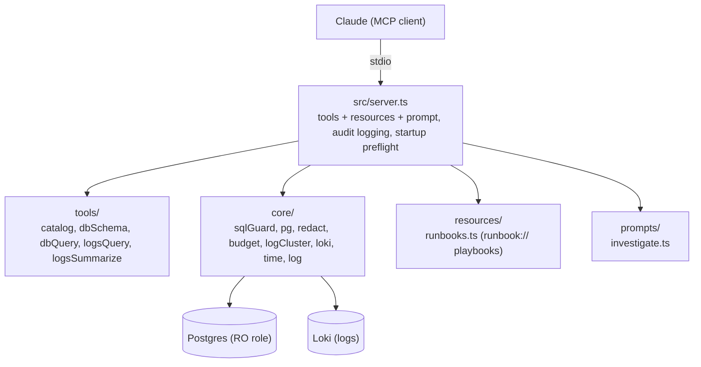

# incident-copilot-mcp

A read-only production-investigation MCP server. An LLM agent investigating an
incident queries application logs (Loki) and correlates against an operational
database (Postgres, read-only) to find root cause, without blowing up its
context window and without being able to write to production.

## Run locally

Requires Node 20+ and Docker.

```bash
git clone https://github.com/halhadad/incident-copilot-mcp.git
cd incident-copilot-mcp
npm install

cp .env.example .env
# If port 5432 is already in use, change POSTGRES_PORT and the port in
# DATABASE_URL / SEED_DATABASE_URL in .env to match.

docker compose up -d   # Postgres + Loki
npm run seed           # schema, incident_ro role, ~20k orders, logs, 4 planted incidents
npm run build
```

Register with Claude Code from this directory:

```bash
claude mcp add incident-copilot -- node ./dist/server.js
```

Or copy the `incident-copilot` block from `.mcp.json` into Claude Desktop's
`claude_desktop_config.json` (use absolute paths there).

Then ask: "Checkout latency spiked, investigate." It calls `logs_summarize`,
`db_schema`, and `db_query`, and should land on the missing index on
`orders.user_id`.

Config is environment variables validated at boot (`src/config.ts`), loaded
from `.env` via dotenv. See `.env.example` for every variable.

Running the evals (`npm run evals`) additionally requires `ANTHROPIC_API_KEY`,
either in `.env` or exported for the shell. This is separate from the test
suites below and isn't part of CI, since it costs real API usage per run.

## Tests

| Suite | Command | Covers |
|---|---|---|
| Unit (41 tests) | `npm test` | SQL guard bypass shapes (CTE writes, `SELECT INTO`, locking), redaction, budgeting/pagination, log clustering, config validation |
| Integration (14 tests) | `npm run test:integration` | Each safety layer against a live Postgres + Loki: raw writes fail as `incident_ro`, the read-only transaction blocks `DELETE`/`SELECT INTO`, `statement_timeout` kills `pg_sleep`, plus end-to-end tool behavior |

Both run in CI (`.github/workflows/ci.yml`) on every push, the integration
suite against real Postgres + Loki service containers.

## Architecture



| Tool | Purpose |
|------|---------|
| `catalog` | Services, tables (with row counts), data time window. Call first. |
| `db_schema` | Schema with foreign keys and indexes, token-budgeted. |
| `db_query` | Read-only `SELECT`. `dryRun: true` returns the EXPLAIN cost without executing. |
| `logs_query` | LogQL query, returned as a budgeted view (counts, facets, sampled lines). |
| `logs_summarize` | Error-rate trend, clustered error/warning signatures, latency percentiles. |

Each tool description exists in two variants (`src/tools/descriptions.ts`):
`v1` is terse, `v2` states when to call it. `TOOL_VARIANT` selects which is
live; the eval harness runs both and scores tool-selection accuracy against
each, since this is a testable claim, not an assumption.

```
src/
  server.ts            MCP server (stdio): tools + resources + prompt + audit logging
  tools/                catalog, dbSchema, dbQuery, logsQuery, logsSummarize, descriptions (v1/v2)
  core/                 sqlGuard, pg, redact, budget, logCluster, loki, time, log
  resources/runbooks    investigation playbooks (MCP resources)
  prompts/investigate   investigation prompt template
seed/                   schema.sql, seedData, seedLogs, incidents (single source of truth)
evals/                  runner (MCP stdio client + agent loop), judge, report, scenarios
test/                   unit tests + test/integration (live-stack suite)
```

## Decisions and tradeoffs

**The actual write boundary is a Postgres role and a read-only transaction,
not application code.** `incident_ro` has `GRANT SELECT` only, and every query
runs inside `BEGIN TRANSACTION READ ONLY` with a `statement_timeout`: both
standard Postgres mechanisms, enforced by Postgres itself regardless of what
this server does. On top of that, an AST guard (`src/core/sqlGuard.ts`)
rejects non-`SELECT` statements and clamps `LIMIT` before a query is even
sent, giving a fast, readable rejection instead of a raw driver error, and
result-side redaction/budgeting shape what comes back. The AST guard is
explicitly not trusted as the boundary: SQL parsers can be fooled, so the
Postgres-enforced role and transaction have to hold regardless. The
integration suite proves each layer independently against a live database
rather than trusting the application code alone.

**Every tool call and every guard denial is audit-logged.** Structured JSON
via pino to stderr (stdout is the MCP transport channel and can't carry log
output): tool name, duration, and error flag on every call, plus the offending
SQL on any guard denial. `LOG_LEVEL=debug` includes full tool arguments.

**Tool descriptions are a variable, not documentation.** Prescriptive
descriptions ("call this first", "check X before assuming Y") measurably
change which tools an agent picks, so this is treated as a design surface
worth A/B testing rather than something to write once and forget.

**Results are budgeted, not dumped.** Logs and query results are large by
nature. `logs_summarize` clusters repeated messages into templates so "this
error occurred 400 times" costs a few tokens instead of 400 lines, and
`budget.ts` caps every tool result to a token budget with cursor-based
pagination on top.

**Runbooks are MCP resources, not baked into tool output.** Each planted
failure mode has a `runbook://` resource listing the expected evidence trail
(e.g. "latency dominant with zero errors: suspect a slow query, check the
warn-level signatures before looking elsewhere"). The `investigate` prompt and
`catalog`'s response both point at these explicitly, since a resource nobody
is told to read doesn't help.

**No auth, on purpose, for now.** The deployment assumption is stdio on a
trusted host: whoever can spawn the process already has the credentials in
its environment. This server stays local; it does not expose an HTTP endpoint
or handle multi-user access, and it isn't meant to.

## Planted incidents

`seed/incidents.ts` is the single source of truth: the seeder plants these and
the evals grade against the same definitions, so they can't drift apart.

| Incident | Log signal | DB evidence | Root cause |
|----------|-----------|-------------|------------|
| `slow_query` | `checkout` latency spike, "slow query on orders" | high EXPLAIN cost on `orders` filter | missing index on `orders.user_id` |
| `payment_failures` | `payments` "provider timeout" spike | many `payments.status = 'pending'` | provider timeouts, stuck payments |
| `inventory_oversell` | `inventory` "negative stock" errors | `inventory.quantity < 0` rows | race condition, oversell |
| `deploy_regression` | `api` deploy marker then error jump | logs only | regression from the latest deploy |

## Production gaps

- PII redaction (`src/core/redact.ts`) is column-name heuristics and value
  regexes. It catches emails, cards, and tokens; it will not catch names,
  base64'd data, or novel formats. Don't point this at data you can't afford
  the model to see.
- Loki access is unauthenticated in the local compose stack. A real
  deployment needs Loki behind auth and should treat log contents as
  untrusted, prompt-injectable input, not just the SQL layer.
- `statement_timeout` and the connection pool size (`DB_POOL_SIZE`) bound
  resource abuse; they don't eliminate it. A hostile agent can still issue
  many expensive-but-legal queries. Point `DATABASE_URL` at a read replica,
  never the primary, in anything resembling production.
- Re-running `npm run seed` re-pushes logs to Loki (append-only); restart the
  `loki` container for a clean slate.
- This is a portfolio/demo project, not a hardened multi-tenant service. If
  you add an HTTP transport for remote access, authentication (OAuth per the
  MCP spec), TLS, and per-client rate limiting need to come first.
